# Build a Data Lake App tutorial

## Tools setup

We are using the following tech-stack:

- Apache NiFi to process and distribute data.
- Apache NiFi Registry to store, manage and version control NiFi resources.
- Apache Airflow to programmatically author, schedule and monitor workflows.
- Postgres as an object-relational database.
- pgAdmin as the administration and development platform for the postgres database.
- MinIO as a locally hosted, S3-compatible object-storage.


Apache NiFi supports powerful and scalable directed graphs of data routing, transformation, and system mediation logic.

Apache NiFi Registry is a subproject of Apache NiFi and is a complementary application that provides a central location for storage and management of shared resources across one or more instances of NiFi. We will use it to version control our data flows and to create templates for repeated use.

Apache Airflow is a scalable because of its modular architecture and uses message queues to orchestrate any number of workers. Its pipelines are written in Python, which means it allows for dynamic pipeline creation from code and is extensible with custom operators.

PostgreSQL is a powerful, open source, object-relational database system which has earned a strong reputation for reliability, feature robustness, and performance.

pgAdmin as the administration and development platform for PostgreSQL.
pgAdmin is an open source database administration and development platform for the PostgreSQL database

MinIO as a locally hosted stand-in for AWS S3 as an object-storage.
MinIO offers high-performance, S3 compatible object storage.

### Part 1: Pre-requisites

1. Install docker: <https://www.docker.com/products/docker-desktop> (**If using windows, Disable WSL during the install, we will use HyperV**)

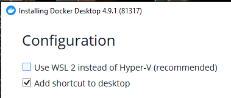
1. git clone <https://github.com/sercasti/datalaketools.git>
1. (If using Windows) Enable file sharing on the Docker desktop app over the folder wher you cloned this repository
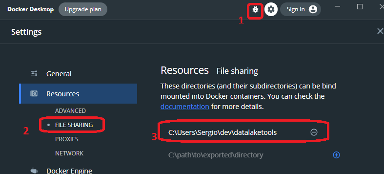
1. Using your command line console (cmd o terminal), get inside the datalaketools folder, and execute: docker-compose up

### Part 2: Connect pgAdmin to the postgres database

Once the "docker-compose up" services are running, you are able to access pgAdmin in your browser: <http://localhost:5050/>, it will ask you to set a master password. Choose a password you can remember.

  1. Click on “Add New Server” in the middle of the page under “Quick Links”
  1. In the General tab: choose a name for your database server, e.g. postgres_db
  1. In the Connection tab: The “Hostname/address” use the hostname mypostgres.
  1. In the Connection tab: The username and password are specified in the docker-compose.yml as environment variables of the postgres service (postgres and postgres if you haven't yet changed it).

### Part 3: Apache NiFi to the NiFi registry (and vice-versa)

Access NiFi registry in your browser: <http://localhost:18080/nifi-registry>

  1. Click on the wrench-symbol in the top right corner of the window.
  1. Click on “NEW BUCKET” on the right side.
  1. Enter a name for you bucket, for instance "myfirstbucket" then use the "Create" button.
  1. Head over to <http://localhost:8091/nifi/> and click on the three bars in the top right corner to access "Controller settings".
  1. Then click on the tab "Registry clients" and on the plus-symbol on the right-hand side.
  1. Put any name you like (i.e. "nify-registry") and URL <http://myregistry:18080>

### Part 4: Apache NiFi to the postgres database

Access NiFi via (<http://localhost:8091/nifi/>)

  1. Drag and drop a "Process group" (4th icon) to the blank space. Set a name and click "add"
  1. Right click the process group and click "Configure"
  1. In the tab "Controller services" add a new controller by clicking the plus-symbol on the right-hand side. Choose DBCPConnectionPool from the long list of available controllers and click Add.

Edit the newly created controller’s properties (using the gear icon) as follows:

- Database Connection URL: jdbc:postgresql://mypostgres:5432/postgres
- Database Driver Class Name: org.postgresql.Driver
- Database Driver Location(s): /opt/nifi/nifi-current/jdbc/postgresql-42.3.3.jar
- Database User: postgres (or whatever you changed it to during setup)
- Password: postgres (or whatever you changed it to during setup)

Click Apply, and enable the service by selecting the lightning-symbol of the line depicting the newly created controller and choosing Enable in the window which opens.

### Part 5: Apache NiFi to MinIO

Access the service in your browser under <http://localhost:9001/dashboard>. The username and password are configured in the docker-compose.yml file via the environment parameters MINIO_ROOT_USER and MINIO_ROOT_PASSWORD. Unless you changed them, they are minio_admin and minio_password.

  1. Click on Buckets in the navigation bar on the left and click Create Bucket in the top right corner.
  1. Choose a name for your bucket, e.g. miniobucket, keep the default configurations and click on Save
  1. Select your bucket and click on Browse.
  1. Create a new directory using the "Create new path" button, call it "test" and within it click the Upload file-symbol to upload minio_testfile.txt that you can find in the root of the cloned directory "datalaketools".
  
### Part 6: Apache Airflow to the postgres database

Open the Airflow service in your browser at <http://localhost:8085/admin/> and click on Admin -> Connections in the top bar. Airflow comes with a lot of connections by default, but let's create a new one for our purpose.

Click on Create and fill in the necessary details:

- Conn Id: mypostgres_connection - the ID with which we can retrieve the connection details later on.
- Conn Type: Postgres - Select it from the dropdown menu.
- Host: mypostgres - Docker will resolve the hostname.
- Schema: postgres - the database name (the label is misleading)
- Login: postgres - or whichever username you set in your docker-compose.yml file.
- Password: postgres - or whichever password you set in your docker-compose.yml file.
- Port: 5432 - the standard port for the database within the docker network.

Then click on "save"

1. Return to the Airflow home, find the "hello_postgres_postgres_operator" DAG and activate it on the left toogle, then click on "Trigger DAG" on the right-hand side (first icon).

### Part 7: Apache Airflow to Apache NiFi

Within the Airflow service in your browser at <http://localhost:8085/admin/> let’s create a connection for our NiFi service as follows. Click on Admin -> Connections in the top bar. Click "Create"

- Conn ID: mynifi_connection
- Conn Type: Postgres (Since there is no NiFi connection type, thus we use postgres as a stand-in.)
- Host: <http://mynifi>
- Port: 8080 (This is the port inside the network, not the one we mapped externally!)

### Part 8: Apache Airflow to MinIO

Within the Airflow service in your browser at <http://localhost:8085/admin/> set up a new connection under the Admin -> Connections GUI:

- Conn ID: myminio_connection
- Conn Type: S3 Since there is no NiFi connection type, thus we use postgres as a stand-in.
Extra: consists of the JSON below:

```
{
  "aws_access_key_id":"minio_admin",
  "aws_secret_access_key": "minio_password",
  "host": "http://myminio:9000"
}
```

### Review

we learned:

- how to configure our services,
- how to connect our services with one another,
- how to make use of the overall infrastructure and
- how the services can interact and communicate with one another.

## Let's build an ETL pipeline with Airflow and NiFi

1. We will create a table and import some data to process on a PostgreSQL table
1. A scheduled Airflow DAG executes a preparatory task
1. Airflow triggers a processor in Apache NiFi
1. NiFi executes an ETL process, which reads the database table, and stores the result on S3 (MinIO)
1. Airflow waits for NiFi to finish,
1. Airflow continues with some other task.

### Postgre Initial Data

1. Open pgAdmin at: <http://localhost:5050/> with the master password you created earlier
1. Navigate the tree panel on the left, open your postgres_db server, open the databases entry, and click on the "postgres" database
Using the Query tool (inside the tools menu), copy paste the contents of the [postgres/create_table.sql](postgres/create_table.sql) to create the initial table, and press "Execute" (the play button)
1. Check your newly created table inside the "Schemas -> public -> Tables" node on the left panel, right click on the table "land_registry_price_paid_uk" and choose "Import/Export"
1. Toogle the popup to "Import"
1. For the filename input, click on the "..." and choose the "pp-monthly.csv" file
1. Header, choose "Yes" and press OK. This should import 126641 rows to the "land_registry_price_paid_uk"

Source: <https://www.postgresql.org/message-id/attachment/92675/land-registry-data.txt>

Now that we have some transactional data to ETL, let's build our pipeline

### Thoughts

While NiFi does have the option to schedule processors with CRON strings, it is usually a bad idea to schedule jobs within NiFi itself — unless you don’t have another choice. Using Airflow we can monitor and schedule all of our tasks, wherever they may be, in one single place with a simple and good-looking interface, access to logs and highly customizable scheduling pipelines which can interact with, in-/exclude or depend on each other.

Similarly, while Airflow can also also execute ETL-tasks (for example coded in Python) that should ideally be implemented in NiFi, you really shouldn’t use Airflow to do so. On the one hand Airflow is built to be a monitoring and scheduling software, on the other hand, we would loose all of NiFi’s inherent advantages concerning data extraction, transformation and loads.

Using Airflow solely as scheduler and letting NiFi do the heavy lifting in our backend, we get the best of both worlds: Airflow’s ability to author, schedule and monitor workflows with NiFi’s scalable, powerful and highly configurable directed graphs to route and transform data.

### NiFi configuration

We need three processors:

- A QueryDatabaseTable processor to act as a starting node of our pipeline which can be triggered from Airflow. This will return the rows from the PostgreSQL table we created above, in Avro format.
- A ConvertAvroToParquet processor to transform the rows to parquet
- A PutS3Object process to write those records to S3 (MinIO)
- An UpdateAttribute processor to act as the end node of our pipeline whose state can be queried by Airflow.

Let's build our first NiFi pipeline, using these processors:

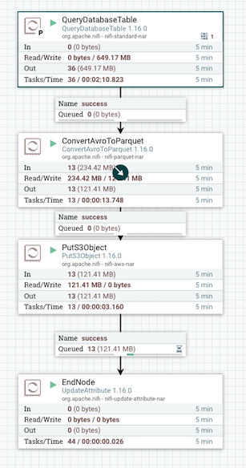

#### Create the Start Node

Head over to <http://localhost:8091/nifi/>, then double click the process group we originally created at (#part-4-apache-nifi-to-the-postgres-database), you can create a new proces group, but double check that "Controller Services" (inside the process group configuration) has the "DBCConnectionPool" service listed and enabled.
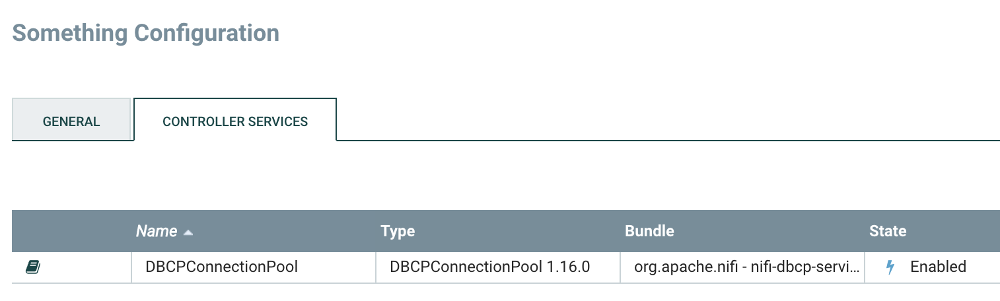

1. Drag the first icon to the NiFi board, thus creating a new Processor
1. Choose the "QueryDatabaseTable" type and click "add"
1. Double click on the Node you just created, switch to the "Scheduling" tab in that processor config, set execution to "Primary Node" and Run Schedule to "60 sec"

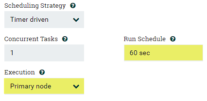

1. Switch to the "Properties" tab in that processor config, and set these properties:

- Database connection pooling: DBCPConnectionPool
- Database Type: PostgreSQL
- Table name: land_registry_price_paid_uk

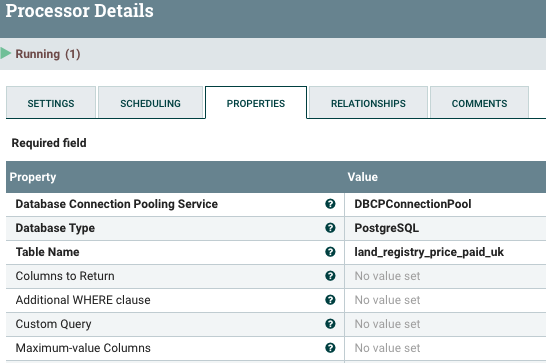

#### Create the convert processor

1. Drag the first icon to the NiFi board, thus creating a second new Processor
1. Choose the "ConvertAvroToParquet" type and click "add"

#### Create the PutS3Object node

1. Create a PutS3 processor with this configuration on the properties tab:

- Bucket: miniobucket
- Credentials File: /opt/nifi/nifi-current/credentials/credentials.properties (the path as specified inside the container)
- **Endpoint Override URL**: <http://myminio:9000> (overriding the endpoint for AWS S3 with the one of our private MinIO instance)

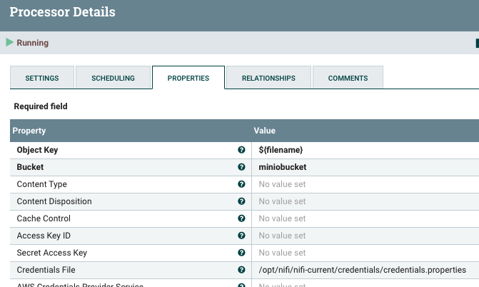

#### Create the EndNode

1. Drag the first icon to the NiFi board, thus creating a new Processor
1. Choose the "UpdateAttribute" type and click "add"
1. Double click on the Node you just created, and change the name to "EndNode"
1. Switch to the "Properties" tab in that processor config, set Store state to "Store state locally"

Now we have everything we need in NiFi — a startnode processor, an endnode processor and whatever we may want to pack in between the two: data extraction, transformation and/or load tasks.

Go ahead, and dragging the arrows on each processor, link them to look like this:


When you connect the links, you need to choose "For Relationship: success"

Fix any processors with an orange warning icon:
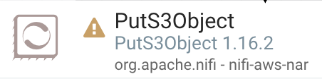. The warning will tell you what's missing, for example, for "Relationship failure is not connected to any component", just set it to auto-terminate:

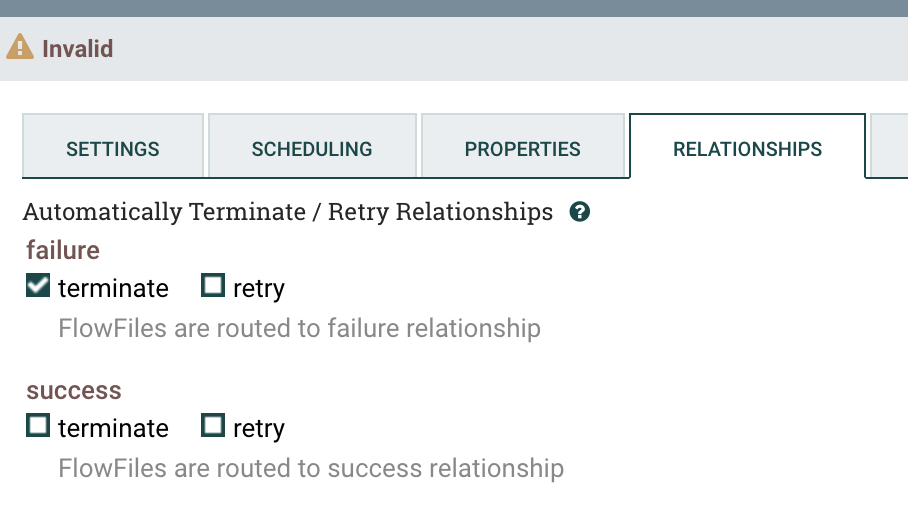

Once all warnings are fixed, choose them all (Ctrl-A o command-a) and click "Start" (the play) button on the left of your screen. This will query the database, convert the avro resultset to parquet, and save the result to MinIo

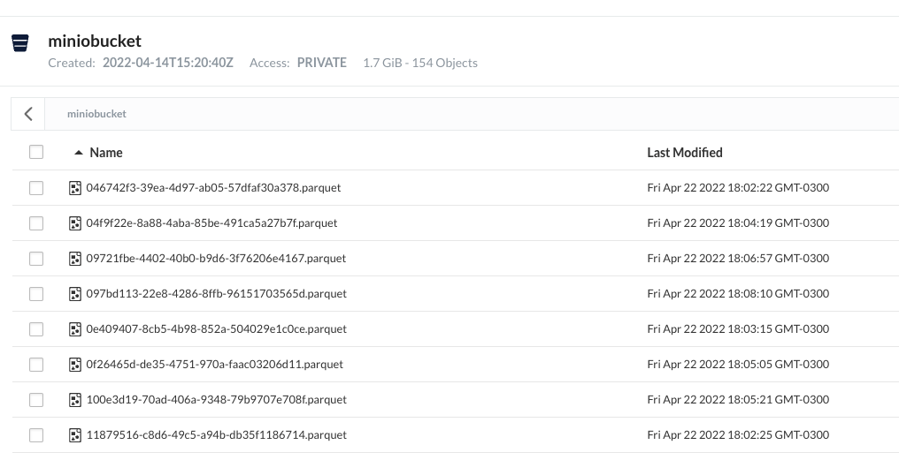

#### Orchestrate the pipeline from Airflow

Click on the QueryDatabaseTable processor we created earlier, and copy the processor id.
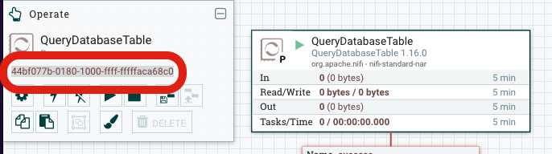

We will trigger that processor from Airflow now. Open the file "airflow/dags/hello_nifi.py" on the code you cloned from git, and in line 17, replace the dummy processor id with the value you just copied in the previous step.

1. Open the Airflow console at <http://localhost:8085/admin/> and find the "hello_nifi" dag. Make sure it is toggled "On",
1. Open the DAG and go to the "Code" tab, make sure your id has been replaced.
1. Use the "trigger DAG" button to start the cycle.

You'll see the Airflow DAG triggering the nifi flow:
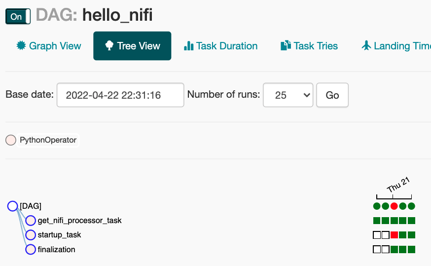
