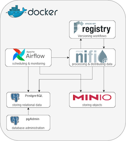

# Build a Data Lake App tutorial

## We are using the following tech-stack

- Apache NiFi to process and distribute data.
- Apache NiFi Registry to store, manage and version control NiFi resources.
- Apache Airflow to programmatically author, schedule and monitor workflows.
- Postgres as an object-relational database.
- pgAdmin as the administration and development platform for the postgres database.
- MinIO as a locally hosted, S3-compatible object-storage.



Apache NiFi supports powerful and scalable directed graphs of data routing, transformation, and system mediation logic.

Apache NiFi Registry is a subproject of Apache NiFi and is a complementary application that provides a central location for storage and management of shared resources across one or more instances of NiFi. We will use it to version control our data flows and to create templates for repeated use.

Apache Airflow is a scalable because of its modular architecture and uses message queues to orchestrate any number of workers. Its pipelines are written in Python, which means it allows for dynamic pipeline creation from code and is extensible with custom operators.

PostgreSQL is a powerful, open source, object-relational database system which has earned a strong reputation for reliability, feature robustness, and performance.

pgAdmin as the administration and development platform for PostgreSQL.
pgAdmin is an open source database administration and development platform for the PostgreSQL database

MinIO as a locally hosted stand-in for AWS S3 as an object-storage.
MinIO offers high-performance, S3 compatible object storage.

### Part 1: setup

1. Install docker: <https://www.docker.com/products/docker-desktop>
1. git clone <https://github.com/sercasti/eureka-client.git> (or download <https://github.com/sercasti/eureka-client/archive/refs/heads/master.zip>)
1. Inside the folder, execute: docker-compose up

### Part 2: Connect pgAdmin to the postgres database

Once the "docker-compose up" services are running, you are able to access pgAdmin in your browser: <http://localhost:5050/>, it will ask you to set a master password. Choose a password you can remember.

  1. Click on “Add New Server” in the middle of the page under “Quick Links”
  1. In the General tab: choose a name for your database server, e.g. postgres_db
  1. In the Connection tab: The “Hostname/address” use the hostname mypostgres.
  1. In the Connection tab: The username and password are specified in the docker-compose.yml as environment variables of the postgres service (postgres and postgres if you haven't yet changed it).

### Part 3: Apache NiFi to the NiFi registry (and vice-versa)

Access NiFi registry in your browser: <http://localhost:18080/nifi-registry>

  1. Click on the wrench-symbol in the top right corner of the window.
  1. Click on “NEW BUCKET” on the right side.
  1. Enter a name for you bucket, for instance myfirstbucket.
  1. Head over to <http://localhost:8091/nifi/> and click on the three bars in the top right corner to access "Controller settings".
  1. Then click on the tab "Registry clients" and on the plus-symbol on the right-hand side.
  1. Put any name you like (i.e. "nify-registry") and URL <http://myregistry:18080>

### Part 4: Apache NiFi to the postgres database

Access NiFi via (<http://localhost:8091/nifi/>)

  1. Drag and drop a "Process group" (4th icon) to the blank space.
  1. Right click the process group and click "Configure"
  1. In the tab "Controller services" add a new controller by clicking the plus-symbol on the right-hand side. Choose DBCPConnectionPool from the long list of available controllers and click Add.

Edit the newly created controller’s properties (using the gear icon) as follows:

- Database Connection URL: jdbc:postgresql://mypostgres:5432/postgres
- Database Driver Class Name: org.postgresql.Driver
- Database Driver Location(s): /opt/nifi/nifi-current/jdbc/postgresql-42.3.1.jar
- Database User: postgres (or whatever you changed it to during setup)
- Password: postgres (or whatever you changed it to during setup)

Click Apply and enable the service by selecting the lightning-symbol of the line depicting the newly created controller and choosing Enable in the window which opens.

### Part 5: Apache NiFi to MinIO

Access the service in your browser under <http://localhost:9001/dashboard>. The username and password are configured in the docker-compose.yml file via the environment parameters MINIO_ROOT_USER and MINIO_ROOT_PASSWORD. Unless you changed them, they are minio_admin and minio_password.

  1. Click on Buckets in the navigation bar on the left and click Create Bucket in the top right corner.
  1. Choose a name for your bucket, e.g. miniobucket, keep the default configurations and click on Save
  1. Select your bucket and click on Browse.
  1. Create a new directory called "test" and within it click the Upload file-symbol to upload minio_testfile.txt
  
### Part 6: Apache Airflow to the postgres database

Open the Airflow service in your browser at <http://localhost:8085/admin/> and click on Admin -> Connections in the top bar. Airflow comes with a lot of connections by default, but let's create a new one for our purpose.

Click on Create and fill in the necessary details:

- Conn Id: mypostgres_connection - the ID with which we can retrieve the connection details later on.
- Conn Type: Postgres - Select it from the dropdown menu.
- Host: mypostgres - Docker will resolve the hostname.
- Schema: postgres - the database name (the label is misleading)
- Login: postgres - or whichever username you set in your docker-compose.yml file.
- Password: postgres - or whichever password you set in your docker-compose.yml file.
- Port: 5432 - the standard port for the database within the docker network.

Then click on "save"

1. Return to the Airflow home, find the "hello_postgres_postgres_operator" DAG and activate it on the left toogle, then click on "Trigger DAG" on the right-hand side.

### Part 7: Apache Airflow to Apache NiFi

Within the Airflow service in your browser at <http://localhost:8085/admin/> let’s create a connection for our NiFi service as follows:

- Conn ID: mynifi_connection
- Conn Type: Postgres (Since there is no NiFi connection type, thus we use postgres as a stand-in.)
- Host: <http://mynifi>
- Port: 8080 (This is the port inside the network, not the one we mapped externally!)

### Part 8: Apache Airflow to MinIO

Within the Airflow service in your browser at <http://localhost:8085/admin/> set up a new connection under the Admin -> Connections GUI:

- Conn ID: myminio_connection
- Conn Type: S3 Since there is no NiFi connection type, thus we use postgres as a stand-in.
Extra: consists of the JSON below:

```
{
  "aws_access_key_id":"minio_admin",
  "aws_secret_access_key": "minio_password",
  "host": "http://myminio:9000"
}
```

### Review

we learned:

- how to configure our services,
- how to connect our services with one another,
- how to make use of the overall infrastructure and
- how the services can interact and communicate with one another.
